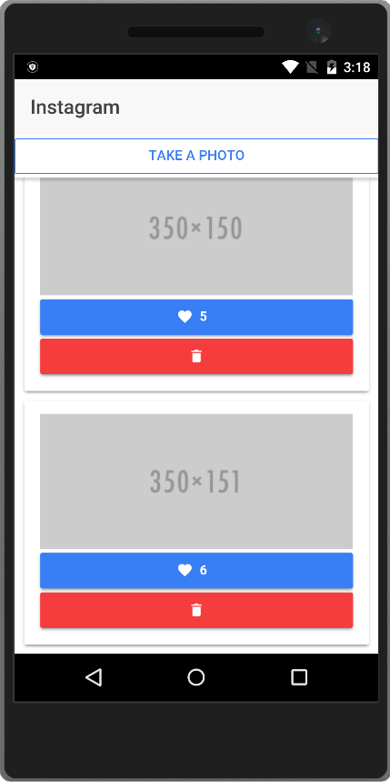

# Instagram

Instagram sample Ionic application using Camera Ionic Native plugin.

# Run the sample 
* install [NodeJS](https://nodejs.org/en/)
* npm install -g ionic
* git clone https://github.com/jamzi/instagram.git
* cd instagram
* ionic plugin add cordova-plugin-camera
* npm install
* ionic serve
* ionic upload (login, upload, run it in the Ionic View application)
